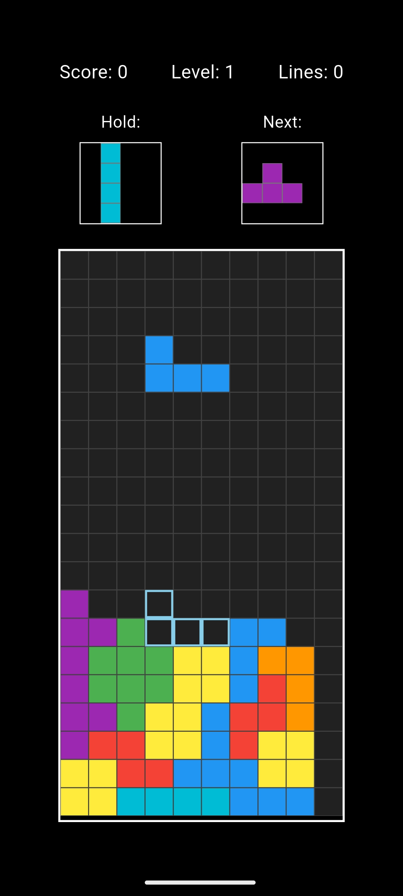

# Block Drop

A modern Tetris clone built with Flutter. Drop, rotate, and clear lines in this classic puzzle game.



## Features

- Classic Tetris gameplay with all 7 tetromino pieces
- Smooth piece rotation and movement
- Line clearing with score tracking
- Hold piece functionality
- Next piece preview
- Responsive controls for mobile and desktop
- Cross-platform support (iOS, Android, Web, Windows, macOS, Linux)

## How to Play

- **Move Left/Right**: Use arrow keys or swipe gestures
- **Rotate**: Up arrow key or tap to rotate pieces
- **Soft Drop**: Down arrow key or swipe down
- **Hard Drop**: Space bar (desktop) or double tap (mobile)
- **Hold Piece**: Hold key or dedicated hold button

## Getting Started

### Prerequisites

- [Flutter](https://docs.flutter.dev/get-started/install)
- An editor e.g. [VSCode](https://code.visualstudio.com/download)

### Installation

1. Clone the repository:

   ```bash
   git clone https://github.com/brandonp2412/BlockDrop block_drop
   cd block_drop
   ```

2. Install dependencies:

   ```bash
   flutter pub get
   ```

3. Run the app:
   ```bash
   flutter run
   ```

## Building for Release

### Android

```bash
flutter build apk --release
```

### iOS

```bash
flutter build ios --release
```

### Web

```bash
flutter build web --release
```

### Desktop

```bash
flutter build windows --release  # Windows
flutter build macos --release    # macOS
flutter build linux --release    # Linux
```

## License

This project is licensed under the MIT License - see the LICENSE file for details.

## Acknowledgments

- Inspired by the classic Tetris game
- Built with Flutter framework
- Icons and assets created specifically for Block Drop
