# Block Drop

A modern Tetris clone built with Flutter. Drop, rotate, and clear lines in this classic puzzle game.

<p float="left">
    <a href="https://github.com/brandonp2412/BlockDrop/releases/latest"></a>
    <a href="https://shields.io/badges/git-hub-downloads-all-assets-all-releases"></a>
</p>

## Features

- Classic Tetris gameplay with all 7 tetromino pieces
- Smooth piece rotation and movement
- Line clearing with score tracking
- Hold piece functionality
- Next piece preview
- Responsive controls for mobile and desktop
- Cross-platform support (iOS, Android, Web, Windows, macOS, Linux)

<a href="https://f-droid.org/packages/com.blockdrop.game"></a>

# Screenshots

Screenshots are auto-generated on every push via `integration_test/screenshot_test.dart` across all themes and styles.

### Light theme

<p float="left">
  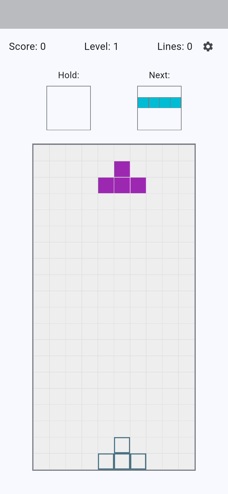
  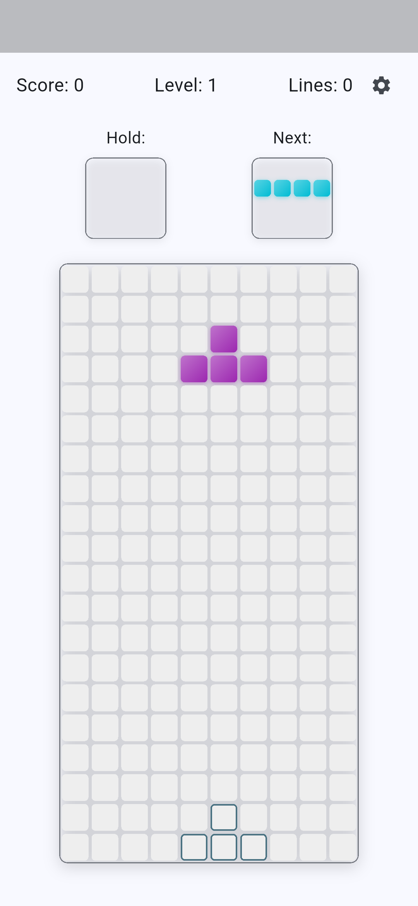
  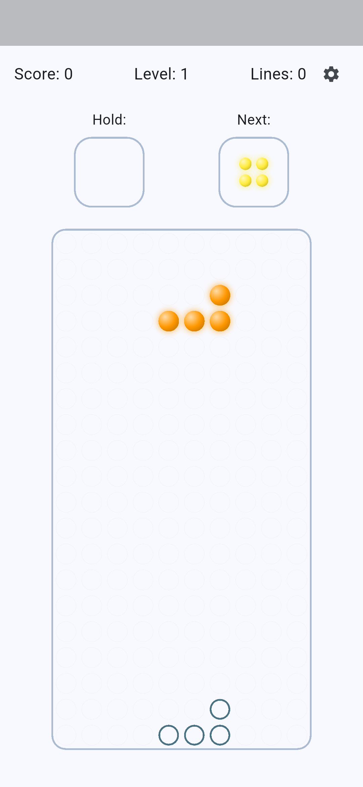
  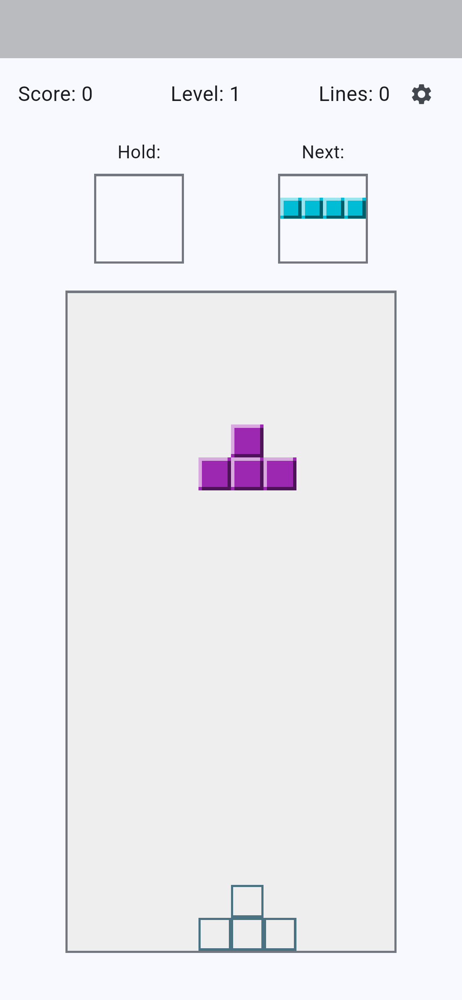
</p>

### Dark theme

<p float="left">
  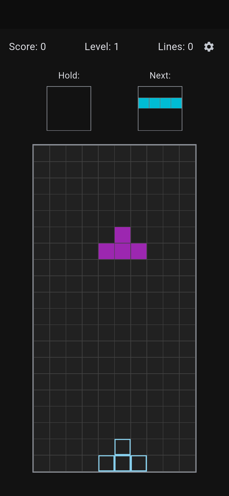
  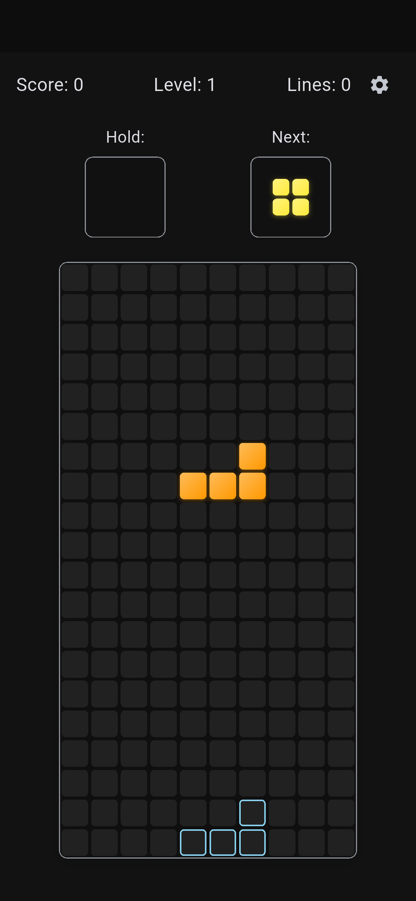
  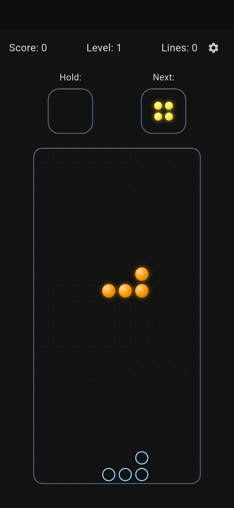
  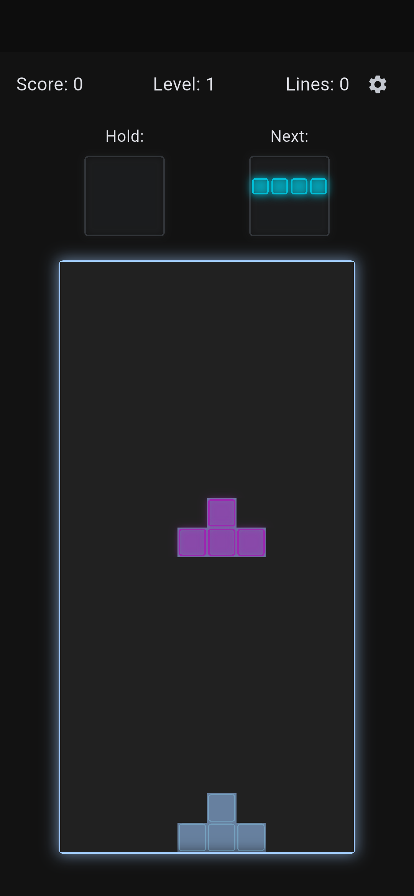
  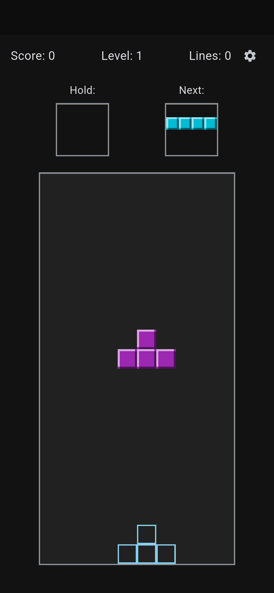
</p>

### Black (AMOLED) theme

<p float="left">
  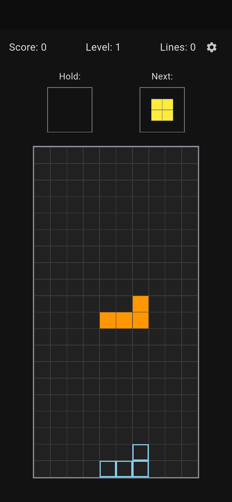
  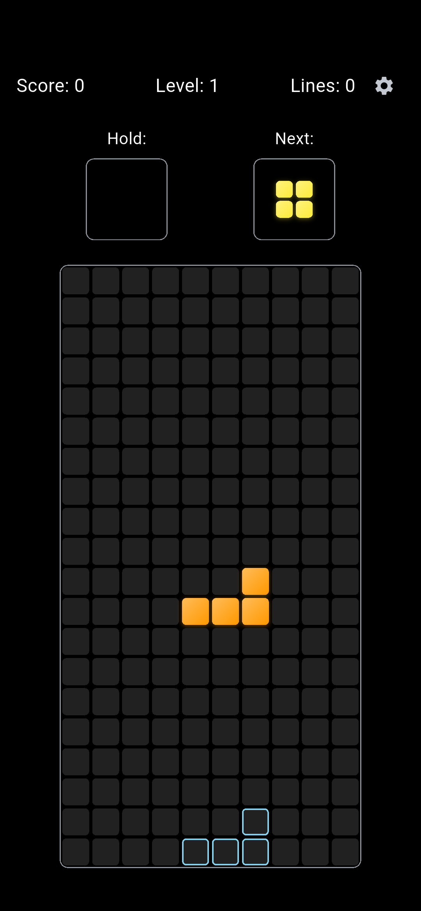
  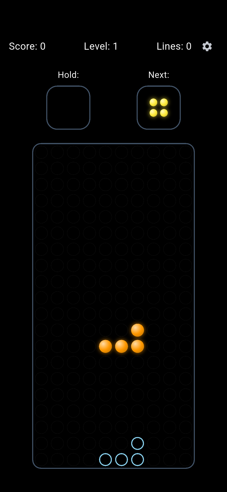
  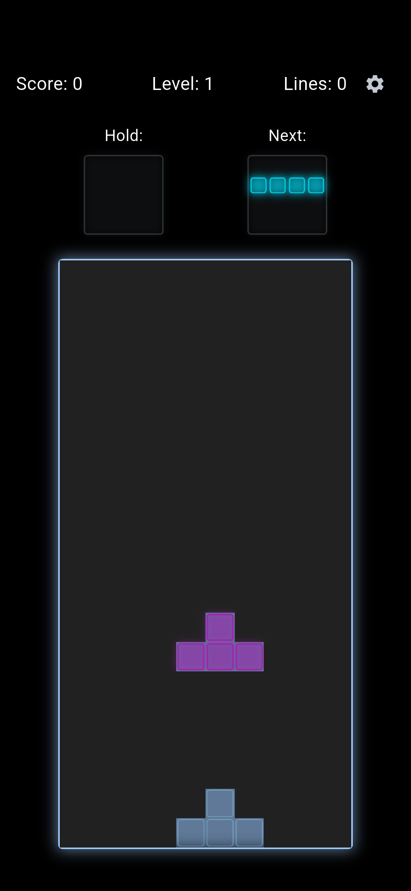
  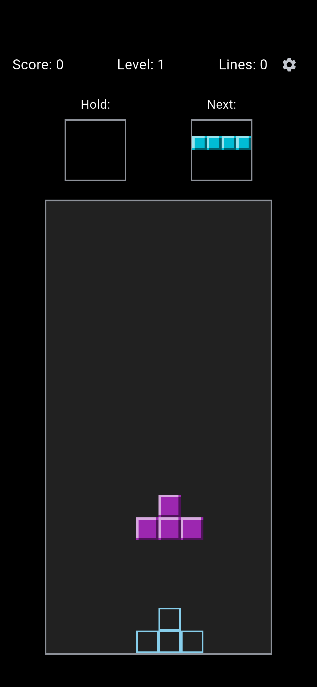
</p>

## How to Play

- **Move Left/Right**: Use arrow keys or swipe gestures
- **Rotate**: Up arrow key or tap to rotate pieces
- **Soft Drop**: Down arrow key or swipe down
- **Hard Drop**: Space bar (desktop) or double tap (mobile)
- **Hold Piece**: Hold key or dedicated hold button

## Getting Started

### Prerequisites

- [Flutter](https://docs.flutter.dev/get-started/install)
- An editor e.g. [VSCode](https://code.visualstudio.com/download)

### Installation

1. Clone the repository:

   ```bash
   git clone https://github.com/brandonp2412/BlockDrop block_drop
   cd block_drop
   ```

2. Install dependencies:

   ```bash
   flutter pub get
   ```

3. Run the app:
   ```bash
   flutter run
   ```

## Building for Release

### Android

```bash
flutter build apk --release
```

### iOS

```bash
flutter build ios --release
```

### Web

```bash
flutter build web --release
```

### Desktop

```bash
flutter build windows --release  # Windows
flutter build macos --release    # macOS
flutter build linux --release    # Linux
```

## Git Hooks

The repository ships with a pre-push hook that enforces code quality and auto-generates screenshots for every theme × style combination before each push.

### What the hook does

1. **`flutter analyze`** — must pass with no issues.
2. **`dart format --set-exit-if-changed lib/ test/ integration_test/`** — source files must be pre-formatted (run `dart format lib/ test/ integration_test/` to fix).
3. **Screenshot generation** — uses `flutter drive` against a running Android emulator to capture all 14 PNGs (3 themes × 5 styles, skipping light+neon) via `integration_test/screenshot_test.dart`. Screenshots are saved by the host-side driver (`test_driver/integration_test.dart`) directly into the standard fastlane metadata directories:
   - `fastlane/metadata/android/en-US/images/phoneScreenshots/<theme>_<style>.png`
   - `fastlane/metadata/ios/en-US/images/iphone67Screenshots/<theme>_<style>.png`
   - `fastlane/metadata/ios/en-US/images/iphone65Screenshots/<theme>_<style>.png`

Step 3 is **skipped gracefully** if no Android emulator is running (lint still passes/fails normally). Start an AVD before pushing to enable screenshot generation.

Set `SKIP_SCREENSHOTS=1` to bypass step 3 entirely:

```bash
SKIP_SCREENSHOTS=1 git push
```

To target a specific device:

```bash
ANDROID_DEVICE_ID=emulator-5554 git push
```

### Installing the hook

**Windows (PowerShell):**

```powershell
pwsh scripts/install-hooks.ps1
```

> Symlink creation requires Windows Developer Mode (`Settings → System → Developer Mode`).
> The installer falls back to copying the hook file if symlinks are unavailable.

**Linux / macOS (Bash):**

```bash
bash scripts/install-hooks.sh
```

### Skipping the hook (one-off)

```bash
# Skip screenshots only
SKIP_SCREENSHOTS=1 git push

# Bypass the entire hook (not recommended)
git push --no-verify
```

### Scripts overview

| File                                    | Purpose                                                                   |
| --------------------------------------- | ------------------------------------------------------------------------- |
| `scripts/pre-push`                      | Cross-platform bash shim — symlinked as `.git/hooks/pre-push`             |
| `scripts/screenshots.ps1`               | Windows implementation (called by the shim on Git-Bash/MSYS2)             |
| `scripts/screenshots.sh`                | Linux / macOS implementation                                              |
| `scripts/install-hooks.ps1`             | Windows installer — creates the `.git/hooks/pre-push` symlink             |
| `scripts/install-hooks.sh`              | Linux / macOS installer                                                   |
| `integration_test/screenshot_test.dart` | On-device test: captures screenshots and reports PNG data back to host    |
| `test_driver/integration_test.dart`     | Host-side driver: receives PNG data and writes to `fastlane/` directories |

## License

This project is licensed under the MIT License - see the LICENSE file for details.

## Acknowledgments

- Inspired by the classic Tetris game
- Built with Flutter framework
- Icons and assets created specifically for Block Drop
